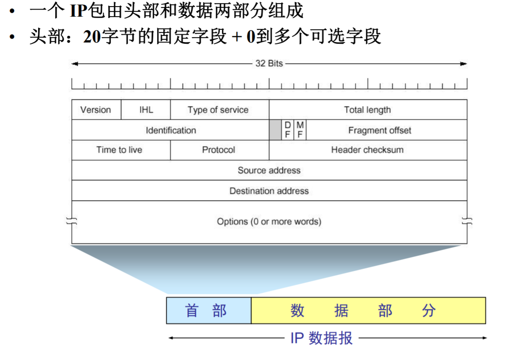
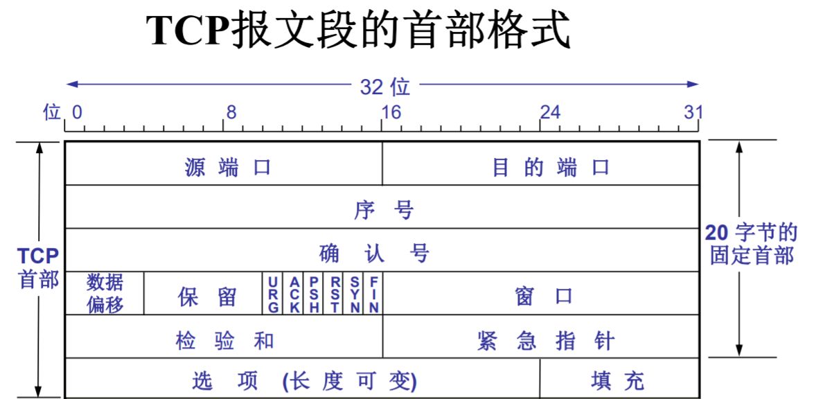
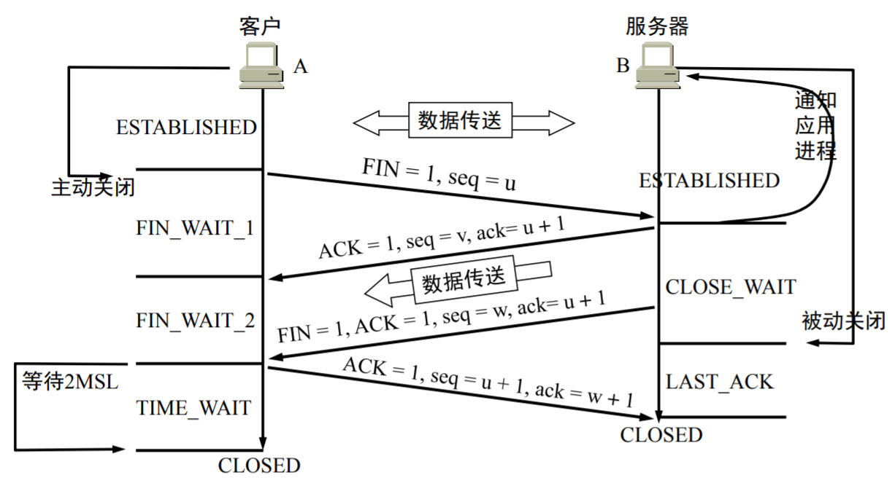
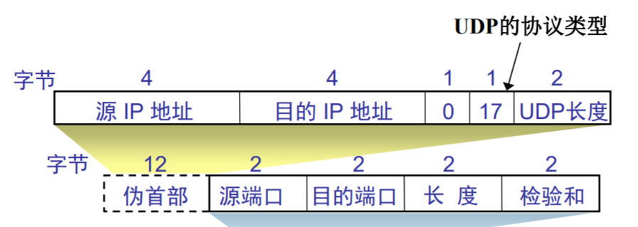

[TOC]

## IO

### epoll poll select

- select通过遍历找到就绪的文件描述符，监视的描述符数量也有限制
- 采用链表实现，没有最大数量限制
- epoll给fd指定回调函数，当描述符就绪后会被加入队列中并执行回调函数，被动触发，不需要轮询

### CPU密集型 IO密集型

## 计网

### 数据链路层

#### 单工停-等协议

接收方发应答帧，发送方收到应答帧再发下一帧

#### ARQ协议

是在有噪声信道中的单工协议（解决传输错误）

- 数据帧丢失或错误
- 确认帧丢失或错误
- 数据出错

##### 停等式

- 接收方通过校验和机制检测帧是否出错
- 确认帧超时或丢失时进行超时重传
- 窗口均为1

##### 回退n帧

- 在检测到发送出错后重传出错开始的n个报文

##### 选择重传

- 只重传错误帧

##### 连续式

- 一次发送一组帧不需要确认

#### 点对点传输协议PPP

- 同步填充：零比特填充
- 异步填充：字符填充

### 网络层

#### ARP协议

IP地址与硬件物理地址的转换问题

#### IP协议

划分子网

#### ICMP协议

封装在IP报文数据部分，报告出错和测试等控制信息

### 传输层

#### TCP

- 面向连接
- 点对点（一对一）
- 可靠
- 全双工
- 字节流

#### TCP报文结构

源端口、目的端口、序号、确认号、标志位、窗口大小、校验和…….

#### TCP三次握手

- 客户端：SYN=1 SEQ = x   进入SYN-SENT
- 服务端：SYN=1 SEQ = y ACK = 1 ack=x+1   进入SYN-RCVD
- 客户端：ACK=1 SEQ = x + 1 ack = y + 1 进入ESTABLISHED(另一边也进)

##### 三次握手的原因

防止失效的用户请求(延迟的等)在服务端积累，造成较大的资源占用

##### 安全问题：SYN FLOODING 攻击

攻击者大量发送SYN报文，但不对SYN-ACK报文进行回应，使得服务器资源空间繁忙

#### TCP四次挥手

- 客户端：FIN=1 SEQ = u 进入FIN_WAIT_1
- 服务端：ACK=1 SEQ = v ack = u + 1 进入CLOSE_WAIT（另一边进入FIN_WAIT_2)
- 服务端：FIN=1 SEQ = w ACK = 1 ack = u + 1 进入LAST_ACK（另一边进入TIME_WAIT)
- 客户端：ACK=1 SEQ = u + 1 ack = w + 1（两边进入CLOSED)

##### 客户端等待2MSL原因

使得本连接内的全部报文都发送完毕，不会影响之后的连接

#### TCP可靠传输

- 滑动窗口机制：发送窗口大小不会超会接收方返回的接收窗口大小；发送窗口在收到确认报文后才能向前移动；接收方在发现报文缺失或错误后也不会发送确认报文。
- 超时重传：为每个报文段设置计时器；超时后即重传。

#### TCP流量控制

- 滑动窗口机制：报头中存在窗口大小字段，发送方通过读得接收窗口大小使得发送窗口不大于接收窗口

#### TCP拥塞控制

- 慢启动：先设置拥塞窗口为1，之后每收到一个确认报文都增加1
- 拥塞避免：每一个RTT（传输轮次）使窗口增加1

发生拥塞时，慢启动门限变为拥塞窗口一半，拥塞窗口变为1，重新慢启动。

- 快重传：收到多个重复确认后重传未收到的报文段
- 快恢复：收到多个重复确认后使慢启动门限变为拥塞窗口大小一半，并启动拥塞避免

#### UDP

只在IP基础上增加了端口和差错检测功能

首部八字节：源端口；目的端口；长度；校验和

#### UDP TCP

- 不可靠的，面向报文的多对多的传输协议
- 可靠的，建立在连接上的面向字节流的点对点传输协议

### 应用层

#### DNS

- 向本地域名服务器发出递归查询
- 向根域名服务器发出迭代查询
	- 根域名服务器给出IP
	- 或者告诉本地域名服务器下一个进行迭代的服务器

#### HTTP

是基于TCP协议的应用层的超文本传输协议，是面向事务且无状态的

#### HTTPS

在HTTP的基础上加上SSL加密传输协议来增加安全性

- 双方协商加密算法
- 服务端将证书发给客户端
- 用CA发布的公钥对证书进行验证，成功后生成对称密钥，并用服务端的公钥进行加密
- 服务端用私钥进行非对称解密，得到客户端密钥，之后都用这个密钥对数据进行加解密

#### HTTP与HTTPS区别

- 后者需要申请证书
- 前者明文传输，后者通过ssl对数据及逆行加密传输
- 传输端口号不同

#### 数字证书

由可信任第三方CA进行证书签发与管理。CA在签发证书的时候先审核申请者的身份，之后便为其分配一个公钥。其它用户可以用这个公钥确认这个证书是否有效。

签名：CA生成证书时用私钥对信息摘要和服务端的公钥等进行加密生成数字签名。

#### HTTP不同版本的区别

- 0.9版本：仅支持GET请求，不支持请求头，仅发送文本
- 1.0版本：支持GET,POST,HEAD；可以传输各类文件；默认短链接，数据发送完毕后断开
- 1.1版本：默认长链接，断点续传（从请求头参数上实现，只请求资源的一部分）
- 2.0版本：基于二进制解析，效率高且准确；支持多路复用，并发处理多个请求；对header进行压缩，加快传输；服务器主动推送

#### HTTP状态码

- 100：继续
- 200：正常
- 301：永久移动
- 302：临时移动
- 401：未授权
- 403：拒绝访问
- 404：资源不存在
- 500：网络错误

#### Session Cookie

##### Session

- 由服务端保存，记录用户的一次会话的状态
- 解决HTTP无状态
- 一般会设置时间，过期销毁

##### Cookie

- 保存用户的一些信息
- 保存在客户端

#### POST GET

##### 使用上的区别

- 传参上GET会在URL中而POST会在BODY中
- GET传输的数据受URL长度限制，POST只受配置或内存限制
- GET可以被缓存，POST不行
- GET只支持URL编码，POST支持多种

##### 深层区别

- GET用于信息获取，应该是安全的幂等的，可缓存
- POST产生更新，不可缓存

## 操作系统

### 内涵

操作系统本质上是一个运行在计算机上的软件程序 ，用于管理计算机硬件和软件资源

### 用户态 内核态

- 用户态：用户应用程序运行的状态
- 内核态：操作系统内核程序运行的状态，控制各类资源，权限高于用户态

### 系统调用

操作系统为用户提供的能访问到内核态资源的接口

### 局部性原理

- 时间局部性：指令的相邻的执行或数据的相邻的访问都发生在一段较短的时间内
- 空间局部性：较近的几条指令操作的数据都集中在较小的区域内

### 虚拟内存 物理内存

#### 虚拟内存

为每个进程提供的一个大的连续完整的私有的地址空间

- 可在较小的物理内存中运行较大的用户程序
- 虚存空间一般大于物理内存
- 可以容纳更多程序并发执行

#### 虚拟地址

链接器将进程的所有程序及运行环境等装配在一起形成的一个规范格局，也叫做进程的逻辑地址空间

#### 虚拟内存原理	

- 初始：仅将当前需要执行的部分页调入内存
- 请求调入
- 置换

### 缺页中断

在请求分页系统中，可以通过查询页表中的状态位来确定所要访问的页面是否存在于内存中。每当所要访问的页面不在内存时，会产生一次缺页中断，此时操作系统会根据页表中的外存地址在外存中找到所缺的一页，将其调入内存。 
　　缺页本身是一种中断，与一般的中断一样，需要经过4个处理步骤： 

     1. 保护CPU现场 
     2. 分析中断原因 
     3. 转入缺页中断处理程序进行处理 
     4. 恢复CPU现场，继续执行 

### 并发 并行

- 并发：存在一个时间点，两个作业都处在执行过程中
- 并行：两个程序在同一时间度量下运行在不同处理机上

### CPU寻址

由虚拟地址得到物理内存地址的过程

- TLB
- 多级页表

### 进程 线程 

#### 进程

- 进程是系统进行资源调度和分配的一个独立单位
- 内存分布：程序的代码和相关数据，进程控制块PCB
- PCB内容：进程标识符；程序和数据地址；当前进程状态；CPU现场保护区；优先级
- 状态：就绪状态，执行状态，阻塞状态，结束状态

#### 线程

- 线程是进程中的一个实体，是CPU调度的基本单位，和其他同进程的线程共享资源

### 僵尸进程 孤儿进程

#### 僵尸进程

子进程先于父进程退出后，父进程没有释放子进程的PCB，成为僵尸进程。

##### 处理方法

- 杀死父进程（不可取）
- 父进程调用wait函数获取子进程退出状态后释放PCB

#### 孤儿进程

父进程先于子进程释放后，它的子进程仍处于运行状态，便成为孤儿进程，会被init进程回收。

### 进程切换

- 保存处理器上下文
- 更新当前PCB
- 将进程转移至合适的队列，选择另一个进程
- 更新PCB
- 更新CPU上下文

### 进程间通信

信号量；管道；共享内存；消息队列；套接字

### 死锁

在一个进程集合中，每个进程都在等待由其它进程才能引发的事件，那么该进程集合处于死锁状态。

#### 条件

互斥条件；不可剥夺条件；请求与保持条件；环路等待条件

#### 检测

资源分配图法；资源矩阵算法

#### 解除

- 强行剥夺资源，挂起原资源
- 杀死进程
- 回滚进程状态（耗费资源）

#### 避免

原则：破坏四大条件之一

- 打破互斥条件：允许某些资源共享
- 打破保持和请求条件：只有系统中含有一个进程需要的全部资源时才分配资源
- 打破不可剥夺条件：允许资源抢占，很可能导致异常
- 打破循环等待：必须按指定的顺序申请资源

#### 预防

#### 银行家算法

一种死锁避免的算法。按指定的策略分配资源或者直接推迟分配。

###### 数据结构

- 可用资源向量
- 最大需求矩阵
- 分配矩阵
- 需求矩阵

###### 算法过程

- 找一个需要资源小于可分配资源的任务，找不到则不安全
- 找到后假设该任务已完成并回收已分配的资源
- 若都完成则安全；若没完成回到第一项

### CPU调度算法

#### 批处理系统

- 先来先服务：FCFS
- 最短作业优先：SJF
- 最短剩余时间优先：SRTF
- 最高响应比优先：HRRF

#### 交互系统

- 时间片轮转算法
- 优先级算法

## Linux常用命令行

## 数据库

### 三大范式

- 第一范式：关系中的每一个分量必须是原子的，不可再分
- 第二范式：第一范式基础上，每个非主属性完全依赖于码
- 第三范式：第二范式基础上，不存在非主属性对码的传递依赖

### 索引

> 是帮助MySql高效获取数据的**数据结构**

#### 分类

- 主键索引
	- 特殊的唯一索引，通过指定的主键来创建
	- 标识记录的唯一性

- 唯一索引
	- 标识的数据不能重复
	- 可以创建多个
	- 允许为NULL
- 常规索引
	- 基本的索引
	- 可以为NULL
- 全文索引
	- 搜索引擎常用技术
- 辅助索引（二级索引）

#### 索引实现

- B+树
- 哈希索引

#### 哈希索引

哈希表实现

- 定位快
- 不支持顺序和范围查询

#### B+树与B树结构区别

- 前者非叶子结点只存索引；后者所有结点都为索引+数据
- 前者叶子结点形成一条顺序链表

#### B+树与B树与红黑树与AVL树优劣比较

- B+树对于B树：非叶结点只存索引，降低了树的高度；数据只在叶结点，每次都要从根到索引行，更稳定；顺序指针，更适合范围查询
- AVL树和红黑树：树的深度会相当大，磁盘IO频繁降低速度。

#### 原则

- 适合WHERE子句中出现的列
- 基数小的列不需要建立
- 不要过度建立索引
- 数据重复且分布平均的表字段，假如一个表有10万行记录，有一个字段A只有T和F两种值，且每个值的分布概率大约为50%，那么对这种表A字段建索引一般不会提高数据库的查询速度

#### 覆盖索引

索引覆盖了要查询的所有字段

### 两种数据库引擎

#### 总体区别

|          | MyISAM                                         | InooDB         |
| -------- | ---------------------------------------------- | -------------- |
| 文件     | 数据索引分开存储 ：.MYD .MYI                   | 集中存储：.ibd |
| 事务     | 不支持事务                                     | 支持事务       |
| 锁       | 支持表级锁                                     | 支持行级锁     |
| 外键约束 | 不支持外键                                     | 支持外键       |
| 索引     | 非聚簇索引（B+树）                             | 聚簇索引(B+树) |
| 指令     | select更快，内部维护了一个计数器，可以直接调取 | 插删改更快     |

#### 索引区别具体叙述

- MyISAM

	- 非聚簇索引，叶子结点保存的是对应记录的指针，可以没有主键

	- 辅助索引和主键索引区别不大

- InnoDB

	- 聚簇索引，主键和行记录存储在一起，叶子结点存储，只有一个。
	- 辅助索引的叶子结点记录主键的值

### 事务

用户定义的一个数据库操作序列并且不可分割

#### 原子性

同一个事务中的操作序列不可分割

#### 一致性

事务前后的数据完整性要保持一致

#### 持久性

事务提交后的结果不会受其它因素改变

#### 隔离性

并发的事务间互不影响

### 隔离产生问题

#### 脏读

一个事务读取了另一个事务未提交的数据

#### 不可重复读

一个事务内多次读取同一数据的结果不同

#### 幻读

一个事务内按相同的方式读取一段记录发现记录增加或减少

### 隔离级别

| 名称                                         | 意义                                                         |
| -------------------------------------------- | ------------------------------------------------------------ |
| 读未提交(read uncommitted)                   | 允许读未提交的数据，三种错误都可能发生                       |
| 读已提交(read committed)                     | 允许读已经提交的数据，解决脏读，后两种错误仍可能发生         |
| 可重复读(repeated-read)  (**mysql默认级别**) | 对同一字段多次读取的结果一致，除非被本事务修改，仍有可能幻读 |
| 可串行化                                     | 最高级别，所有事物依次逐个执行                               |

#### MVCC机制

- 概述：是一种通过多版本控制提高并发的技术，使得事务之间只有写写需要阻塞。
- InnoDB中的实现：
	- 隐藏字段：每一条记录有两个起作用的隐藏字段：最新修改的事务ID，回滚指针
	- Undolog：版本链，以之前说的ID大小为顺序，顺着这条链可以回溯版本
	- ReadView：当前事务执行第一个select时创建的快照，包含不该被本事务看到的其它正在活跃事务的ID有序列表
	- 过程：用当前记录的最新ID和ReadView列表中的ID进行比较，判断是否需要回滚
		- 如果小于最小的，说明快照生成前该记录最新修改对应的事务已经提交，修改可见
		- 大于最大的，说明生成快照之后该记录最新修改对应的事务才被创建，回滚
		- 二分查找存不存在，存在说明修改未提交，不可见；反之可见
- 提问：RC和RR下的快照有何不同
	- 生成时机不同，RC每个快照读都生成ReadView；RR第一次快照读才生成ReadView
	- RC由此会读到新的ID，所以是RC。
- 在此情况下，写操作仍然能看到最新数据，仍然可能导致幻读

### Select for update和MVCC各自解决了什么问题?

### 查询优化

- 只查询需要的数据，使用limit/只查询部分列
- 建立索引
- 

### 锁

#### 行锁

##### 优点

- 当在许多线程中访问不同的行时只存在少量锁定冲突。
- 回滚时只有少量的更改

##### 缺点 

比页级或表级锁定占用更多的内存

